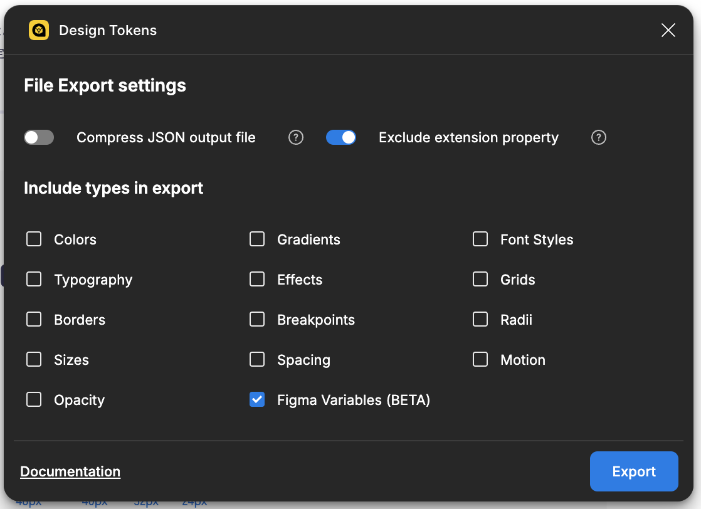

# TechTrain Terminal Design Tokens

[](https://badge.fury.io/js/%40techtrain%2Fterminal-design-tokens)
[](https://opensource.org/licenses/MIT)

Design tokens for TechTrain's design system "Terminal". This package uses [Style Dictionary](https://amzn.github.io/style-dictionary) to transform tokens defined in JSON into multiple platform outputs.

## Features

- Consistent design tokens across platforms
- JavaScript/TypeScript support
- CSS/SCSS variables
- Semantic naming conventions
- Supports color, typography, sizing, and spacing tokens

## Installation

```bash
npm i @techtrain/terminal-design-tokens
```

## Usage

```typescript
import DesignToken from '@techtrain/terminal-design-tokens';
```

## Development

The design tokens are managed in the [TechTrain Terminal Figma Community File](https://www.figma.com/community/file/1472050808130527580).

Since our current plan doesn't have access to Figma Variables API, we export tokens manually using the [Design Tokens](https://www.figma.com/community/plugin/888356646278934516/design-tokens) plugin.

### Updating Tokens

1. Open the Design Tokens plugin
2. Select the `Export` tab
3. Check `Exclude extension property` and `Figma Variables`
4. Click the "Export" button to download the JSON file
5. Place the downloaded JSON file in the `tokens/` directory
6. Run `npm run build` to generate platform-specific tokens



## License

MIT
